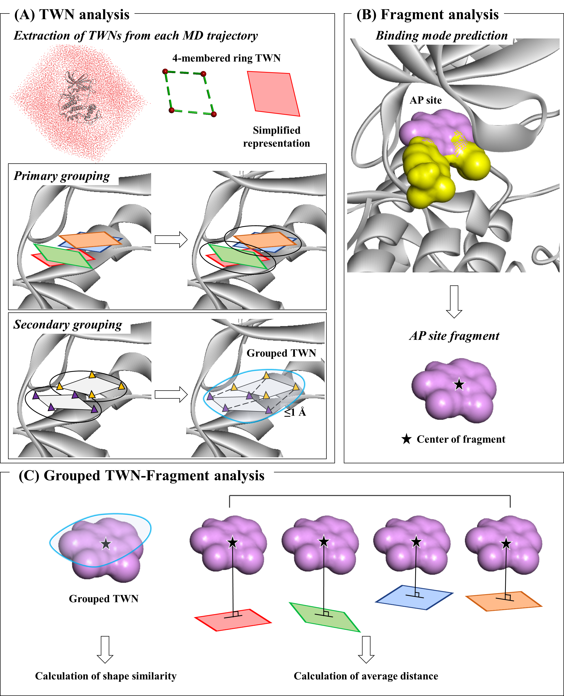

# TWN-FS



Water molecules contribute to structure and function of proteins and also influence the environment within the binding pocket. 

Water molecules form a variety of hydrogen-bonded cyclic water-ring networks, collectively known as topological water networks (TWNs). 

Analyzing the TWNs in protein binding sites can provide valuable insights into potential locations and shapes for fragments within the binding site. 

Here, we introduce TWN-based fragment screening (TWN-FS) method, a novel screening method that suggests fragments through grouped TWN analysis within the protein binding site. 

## Installation
This code was tested in windows with Python 3.9.

A yaml file containing all requirements is provided.

This can be readily setup using conda.

```sh
conda env create -f TWN-env.yaml
conda activate TWN-env
```

## Standard Usage

### _TWN_automation.py_

The fastest way to run TWN-FS.

Analyze TWNs-fragment of multiple proteins in one running.

TWN_analysis.py and TWN_gridbox.py are operated sequentially.

Outputs :
* TWN.pdb : pdb file (grouped TWNs-fragment visualization, only oxygen atoms are displayed).
* Summary.xlsx : summary of results grouped TWNs-fragment calculation scores (shape similarity and average distance).
* TWN_Group_inform.xlsx : information(TWNs-configuration, coordinates, counts) of grouped TWNs-fragment.
* TWN_Group_Centor_Point.tsv : centroids of grouped TWNs-fragment.
* OBMol : sdf file converted from pdb file.
* Distance_Average, ShaEP : calculation scores (shape similarity and average distance).
* Analysis.txt, TWN_gridbox.txt : log files of .py that was executed.


```sh
python TWN_automation.py -twn parent parent_path_of_twn_folder -region subregion_path -shaep shaep_path -ref reference_file -out output_path 
```

For example:

```sh
python TWN_automation.py -twn ./data/TWNs -region ./data/region -shaep ./data/shaep/shaep.exe -ref ./data/reference_form.xlsx -out ./data/output
```

## Advanced Usage

### _TWN_gridbox.py_

Grouping TWNs-fragment (primary clustering and secondary clustering).

Define the protein file to display in Complex.pdb. ('-pt' option)

Define the range of grouped TWNs-fragments to extract. The criteria is ligand file. ('-bd' option)

Create a complex.pdb that visualizes the protein together so that the location of the grouped TWNs-fragments is known. ('-c' option)

Outputs:
* Complex.pdb : visualize grouped TWNs-fragment and protein structure.
* TWN.pdb
* TWN_gridbox.txt
* TWN_Group_Centor_Point.tsv


```sh
python TWN_gridbox.py -twn TWN_file -pt protein_file -bd boundary_file -o output_path -c complex 
```

For example:


```sh
python TWN_gridbox.py -twn ./data/TWNs/CDK2 -pt ./data/protein_CDK2.pdb -bd ./data/boundary_STU.pdb -o ./data/output -c 
```

### _TWN_anlysis.py_

Calculate shape similarity and distance average as a result of TWN_gridbox.py.

Sets the criteria for selecting shape similarity and distance average for grouped TWNs-fragments, ascending or descending ('-cond' option)

Outputs:
* same as TWN_automation.py

```sh
python TWN_anlysis.py -twn path_of_twn_folder -region subregion_path -shaep shaep_path -ref reference_file -out output_path -cond set_condition_of_extract_values
```

For example:

```sh
python TWN_anlysis.py -twn ./data/TWNs/CDK2 -region ./data/region -shaep ./data/shaep/shaep.exe -ref ./data/reference_form.xlsx -out ./data/output -cond True
```


## Contact (Questions/Bugs/Requests)
Please submit a GitHub issue or contact me [rudwls2717@naver.com](rudwls2717@naver.com)

## Acknowledgements
Thank you for our [Laboratory](https://homepage.cnu.ac.kr/cim/index.do).

If you find this code useful, please consider citing our work.
